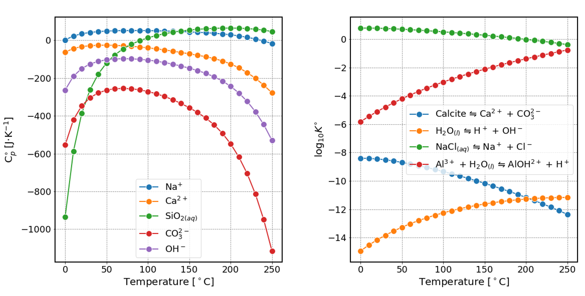

# Summary

ThermoFun [thermohub.org/thermofun](https://thermohub.org/thermofun) open source library provides standard thermodynamic properties of substances and reactions calculated at given temperature and pressure. The library can be used from C++ and Python to do single or bach calculations and can be coupled to to any modeling code which requires thermodynamic data as input or to codes for model parameter fitting. Results can be written to file in a table or other formats or passed in memory to coupled codes that call the library. For its calculations, ThermoFun can use input properties and model parameters of different thermodynamic datasets that are read from local files or are retrieved via remote access to ThermoHub ([thermohub.org/thermohub](https://thermohub.org/thermohub)). The library contains a comprehensive collection of models and equations of state for: solid, aqueous, gaseous, and melt substances, and their reactions. A certain model or equation of state is not present? ThermoFun library is extendable with new methods and equations of state, taking advantage of the modular structure. The open source code is available at: [https://github.com/thermohub/thermofun](https://github.com/thermohub/thermofun)

# Statement of need

Thermodynamic modelling provides valuable insight into chemical systems and allows us to investigate processes that occur under conditions and time scales that cannot be reached in laboratory settings. An unavoidable step in any realistic application of geochemical thermodynamic modelling is the calculation of standard thermodynamic properties of all involved substances and reactions at temperature and pressure of interest [@Leal2017]. This is done using equations of state that relate thermodynamic properties to temperature and pressure. The quality of thermodynamic modeling results are strongly influenced by the predictive capability of the method and the availability, accuracy, precision and consistency of input parameters in thermodynamic datasets.

Many different methods have been developed that allow extrapolation of standard thermodynamic properties over a wide range of conditions. These methods can have complex mathematical formulations, a large number of input parameters, can require iterative numerical procedures or a combination of several methods is be necessary to calculate properties of a certain type of substance. For example, the properties of the solvent are used to calculate the properties of the solutes. Selective implementations of extrapolation methods and equations of state can be found in existing thermodynamic modeling codes or as standalone codes that work with specific thermodynamic datasets and file formats. This makes it difficult to retrieve properties calculated with different methods and use them in different codes, or to investigate, compare and tabulate thermodynamic data coming from different sources. With many existing thermodynamic datasets, equations of state, modeling codes and file formats, it can be difficult and time consuming to collect such data and to apply suitable methods in modeling calculations. 



The open-source ThermoFun library, provides standard thermodynamic properties of substances and reactions \autoref{fig:properties}. These are calculated using the extensive collection of methods available in ThermoFun using input properties and parameters from different thermodynamic datasets retrievable from the ThermoHub online database or provided as local files. The library is extendable with new methods and has access to the evolving collection of thermodynamic datasets from ThermoHub. These datasets contain reference thermodynamic data applicable in various studies on hydrothermal processes, cementitious materials, nuclear engineering, waste incineration management and disposal, and other (geo)chemical environments. Access to many thermodynamic datasets, methods and equations of state, allows for more efficient use of these in modeling codes, or to optimize/fit the methods’s parameters, evaluate its performance, range of applicability and accuracy. ThermoFun provides the flexibility of using thermodynamic datasets and appropriate methods, or a combination of methods that are best suited for different classes of substances necessary in various modeling applications. 

The library can be linked to any C++ or Python geochemical modelling code and used as source of standard thermodynamic properties, or can be simply used for tabulating thermodynamic properties of substances and reactions. ThermoFun was used to calculate the properties of reactants and reactions at elevated temperatures when evaluating the use of isocolomibc reactions to estimate properties of aqueous complexation reactions for lanthanides and actinides [@Miron2020]. The library was used to evaluate the effect of using different equations of state for water solvent on the calculated properties of dissolved aqueous species[@Miron2019]. 
ThermoFun is already used as a source of thermodynamic data in GEMS codes [gems.web.psi.ch](https://gems.web.psi.ch/) [@Kulik2013] and in Reaktoro geochemical modeling framework [reaktoro.org](https://reaktoro.org) [@Leal2016]. 

# Features

The main classes of ThermoFun are `Database`, `ThermoEngine`, and `ThermoBatch`. `ThermoEngine`, and `ThermoBatch` are initialized with the `Database`. The `Database` is initialized with a thermodynamic dataset. A thermodynamic dataset is also known in the (geo)chemical literature as a thermodynamic database with records of elements, substances and reactions that contain various data like symbol, formula, reaction equation their thermodynamic properties and model parameters that are needed in the calculations, etc. Theses data are compiled, critically selected from literature and may be also fitted against experimental data to be used in modeling codes to calculate chemical equilibrium in different chemical systems. Thermodynamic datasets used in ThermoFun can be read locally from files or retrieved via remote access to ThermoHub online database. ThermoHub contains a collection of thermodynamic datasets that are widely used in various modeling applications [thermohub.org/thermohub](https://thermohub.org/thermohub/thermohub/#thermodatasets). The online ThermoHub database is actively extended with existing, and newly updated and developed datasets prepared by thermodynamic database experts and thus made available for calculations with ThermoFun. In general, the calculations are done using one consistent dataset but there is also the possibility to use custom datasets, combine them and append additional data from user maintained files. The data format of `ThermoHub` is JSON (Java Script Object Notation) and using `ThermoHubClient` thermodynamic datasets are retrieved into a simplified `ThermoFun` format and saved to text files that can edited and extended. 

ThermoFun engine class `ThermoEngine` contains functions that return the standard state thermodynamic properties of a substance or reaction at the given temperature and pressure. For water solvent, additional specific properties like water density, dielectric constant can be retrieved. A low level fine grained access up to individual methods is also possible. 
`ThermoBatch` class can be used to do batch calculations, for a list of substances, reactions, and temperature and pressure intervals. `ThermoBatch` can be also used to output the results in tabulated comma separated values (CSV) or other data formats. 

Reaction properties can be calculated for reaction records present in the thermodynamic dataset in this case the extrapolation at temperature and pressure is done using the method and input parameters available in the reaction record. Another option is to provide reaction equations written using symbols of substances available in the thermodynamic dataset (e.g., Calcite $\leftrightharpoons$ Ca$^{2+}$ + CO$_{3}^{-2}$). In this case the properties of the reactions are calculated from the properties of the reactants extrapolated based on the methods defined in their records. Substance properties are calculated using the specified equation of state and the input parameters provided in the dataset record. Another option is to set a reaction that defines the substance properties. In the case of a reaction dependent substance, the properties are calculated from the reaction properties and the properties of the other reactants that take part in the reaction. One dataset can contain a combination of substances, reaction dependent substances and reactions that have their properties calculated consistently calculated using a recursive method.

# Examples

Loading the `aq17` thermodynamic dataset [@Miron2016;@Miron2017] and calculating the properties of a substance (calcium aqueous ion $Ca^{2+}$):

```python
  import thermofun as fun
  database = fun.Database("aq17-thermofun.json")
  engine = fun.ThermoEngine(database)
  #                                        T(K)   P(Pa)  symbol
  Ca_ion = engine.thermoPropertiesSubstance(473, 2000e5, "Ca+2")
  print(f'G0 {Ca_ion.gibbs_energy.val} J/mol')
```

  `G0 -545301.2878298083 J/mol`

Calculating the properties of a reaction given as a reaction equation (calcite dissolution):

```python
  #                                    T(K)   P(Pa)  reaction equation
  R = engine.thermoPropertiesReaction(348.15, 1e5, "Calcite = Ca+2 + CO3-2")
  print(f'drS of (Cal = Ca+2 + CO3-2) is {R.reaction_entropy.val}')
  print(f'drG of (Cal = Ca+2 + CO3-2) is {R.reaction_gibbs_energy.val}')
  print(f'logK of (Cal = Ca+2 + CO3-2) is {R.log_equilibrium_constant.val}')
```

```
drS of (Cal = Ca+2 + CO3-2) is -259.12288450418015
drG of (Cal = Ca+2 + CO3-2) is 59914.092580924975
logK of (Cal = Ca+2 + CO3-2) is -8.988976334909019
```

Using the batch class to do sequential calculations and output the results to a CSV file:

```python
  batch = fun.ThermoBatch(database)
  batch.setPropertiesUnits(["temperature", "pressure"],["degC","bar"])
  batch.setPressureIncrement(0,0,0)
  batch.setTemperatureIncrement(0,300, 5)
  substances = ["Na+", "Mg+2", "Ca+2", "SiO2@"]
  properties = ["heat_capacity_cp","entropy", "volume"]
  batch.thermoPropertiesSubstance(substances, properties).toCSV('results.csv')
```

Jupyter notebooks with examples on how to use `ThermoFun` can be found here [https://github.com/thermohub/thermofun-jupyter](https://github.com/thermohub/thermofun-jupyter). More complex scripts and routines can be coded that call `ThermoFun`. For example, `ThermoFun` can be coupled to a phase diagram plotter, a chemical equilibrium solver that require properties of all components in the system, or a parameter optimization routine for fitting the parameters of the methods available in ThermoFun. 

# Acknowledgements 

# References
